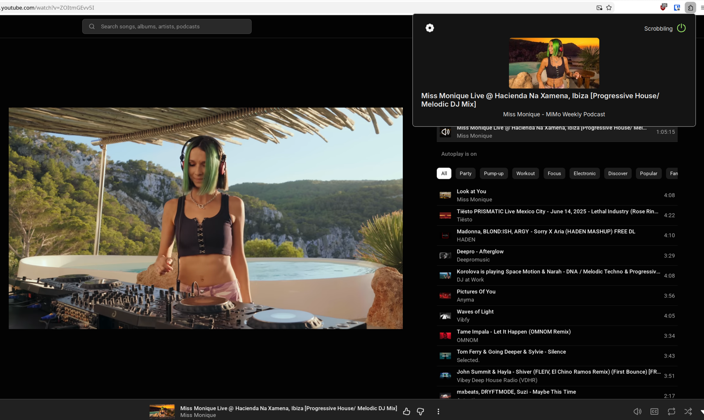
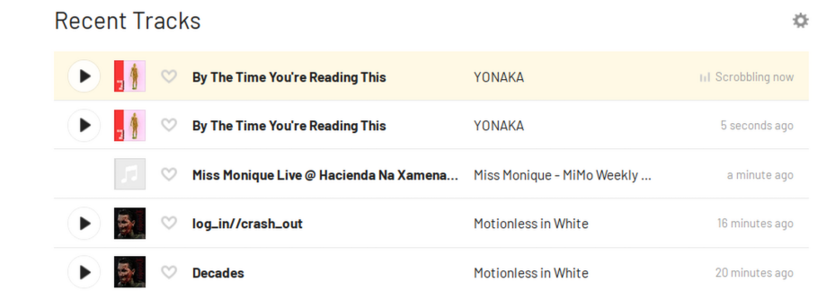

  

  # YouTube Music FM 

  

    
    
    
  

This an extension for YouTube Music to sync your songs/podcasts with Last FM. This had to be made because other extensions like Web Scrobbler completely break the song names and albums just by having characters that could break regex.

# Installation
TBD
