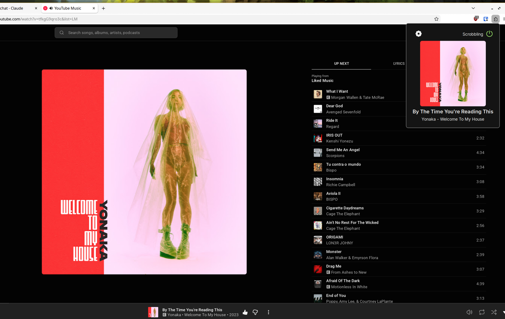

  

  # YouTube Music FM 

  

    
  

This an extension for YouTube Music to sync your songs/podcasts with Last FM. This had to be made because other extensions like Web Scrobbler completely break the song names and albums just by having characters that could break regex and it shouldn't even be using it in the first place.

# Installation
## Store
This extension is available at the [firefox addons](https://addons.mozilla.org/en-US/firefox/addon/youtube-music-fm/) website.
## Manual
Go to [releases](https://github.com/lighttigerXIV/yt-music-fm/releases) and download the appropriate file.

### Firefox
1. For firefox download the `xpi` file.
2. Go to `about:addons` and install the local addon.

### Chrome
1. For chrome download the `crx` file.
2. Go to `chrome://extensions`.
3. Enable developer mode.
4. Drag the crx file into chrome.

